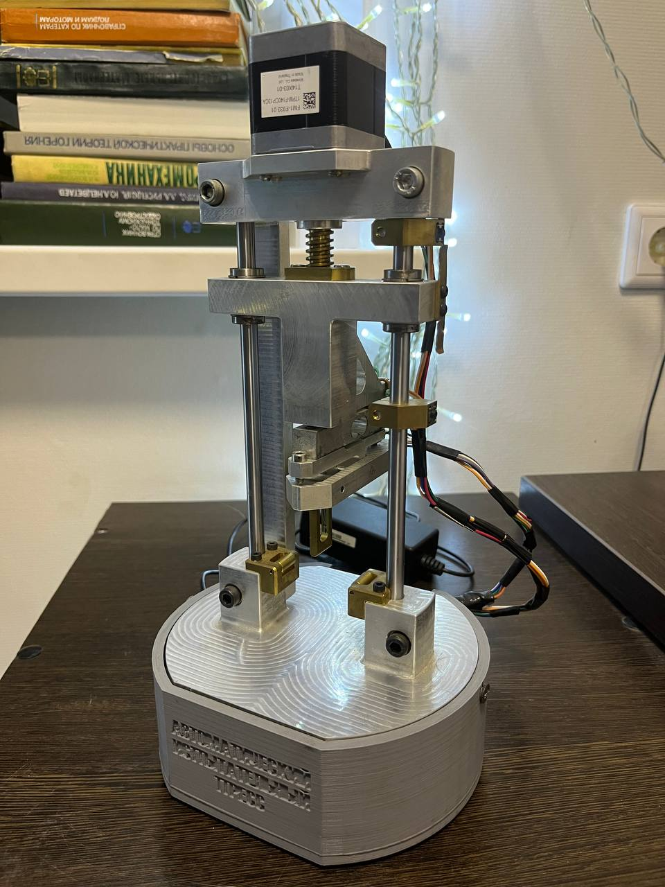

# arduino-testing-press
[ArduinoC] Press for the study of the properties of various materials

***Libraries used:***\
***[HX711 v0.7.1](https://github.com/bogde/HX711)***\
***[Encoder v1.4.2](http://www.pjrc.com/teensy/td_libs_Encoder.html)***

## Getting started
1. Cloning this repository
2. [Installing used libraries](https://docs.arduino.cc/software/ide-v1/tutorials/installing-libraries)
3. Build **sketch/sketch.ino** in [Arduino IDE](https://github.com/arduino/arduino-ide/)

## Pictures

  
   
  Device

